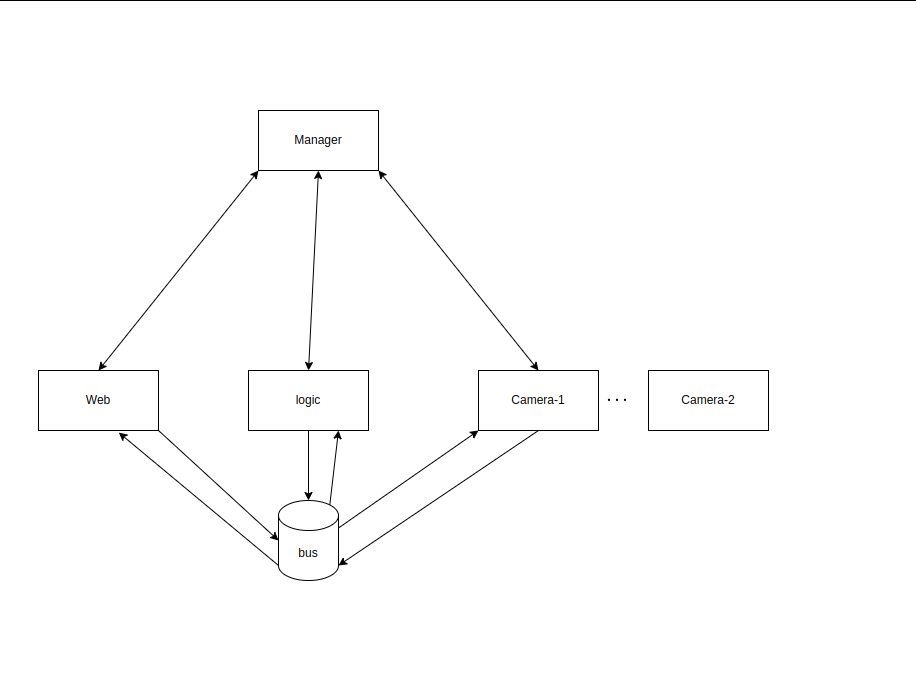
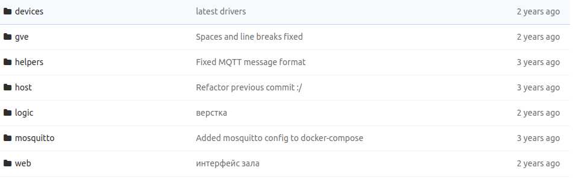

# Документация
## Общая архитектура
Проект иницилазизируется и управляется с помощью главного запускаемого процесса: init.py. Будем называть модулями сабпроцессы, которые вызываются из init.py и которые логически отличаются. В проекте существуют разного вида модули: отвечающий за логику, отвечающий за веб-интерфейс и отвечающие за девайсы. Причем поскольку девайсов много, то и модулей отвечающих за девайсы много. А модуль логики, как и модуль веб-интерфейса, всего один.
Каждый сабпроцесс (модуль) подключается к mqtt и инициализируется с помощью init.py, он передает ему нужный конфиг. Далее все модули работают, а главный модуль init.py смотрит за их работоспособностью.

## Файловая структура
Директории находятся в корневом каталоге. Всего 3 главных директории: logic, web, и devices. В корневом каталоге находится файл init.py и там же находится главный yml-конфиг. В web и devices конфигов нет. Все конфиги, необходимые для работы logic, web и devices модулей парсятся из главного конфига.

## Процесс запуска
Запускается основной процесс init.py. Он загружает главный конфиг и разбивает его на конфиги, необходимые модулям. Также он запускает сабпроцессы, которые отвечают за модули. init.py подключается к mqtt и слушает запросы на получения конфигурации. Сабпроцессы также подключаются к mqtt и отправляют эти самые запросы. Запускает модули, отвечающие за устройства. Параметр, отвечающий за имя модуля, передается в сабпроцесс. Сабпроцессы (модули) получают конфиги из mqtt. Если 3 раза с таймаутом 10 сек. модулю никто не отвечает, то он умирает. А управляющий процесс init его перезапустит. Далее все модули получают конфиги и работа системы начинается. Также существуют для каждого модуля дефолтная конфигурация.
